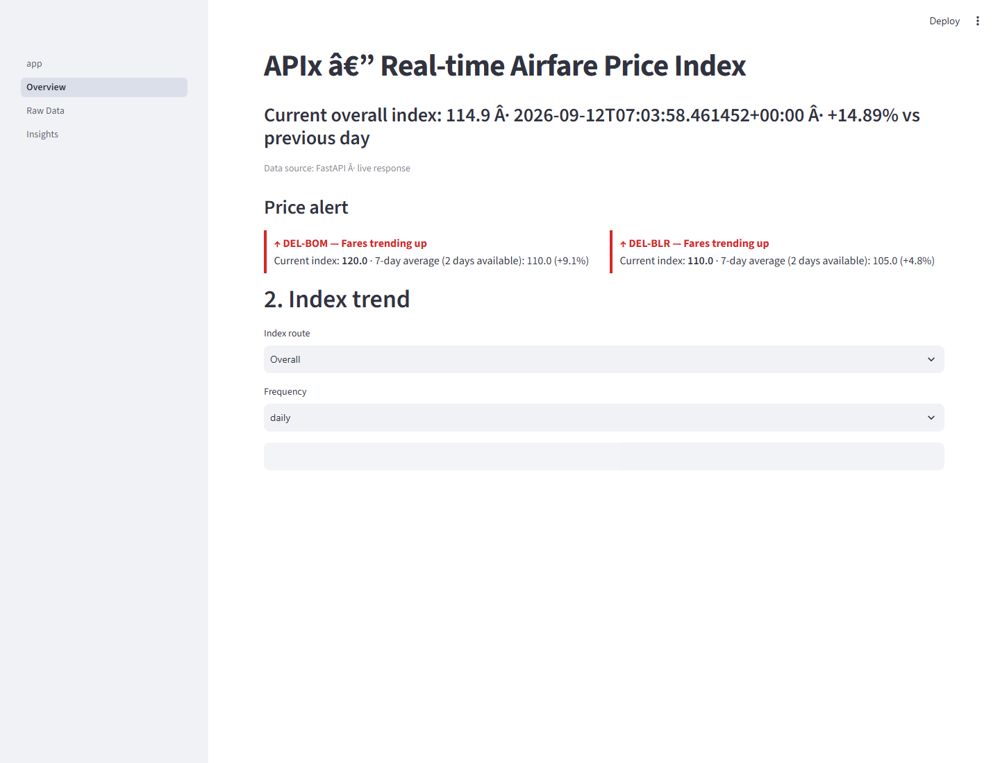
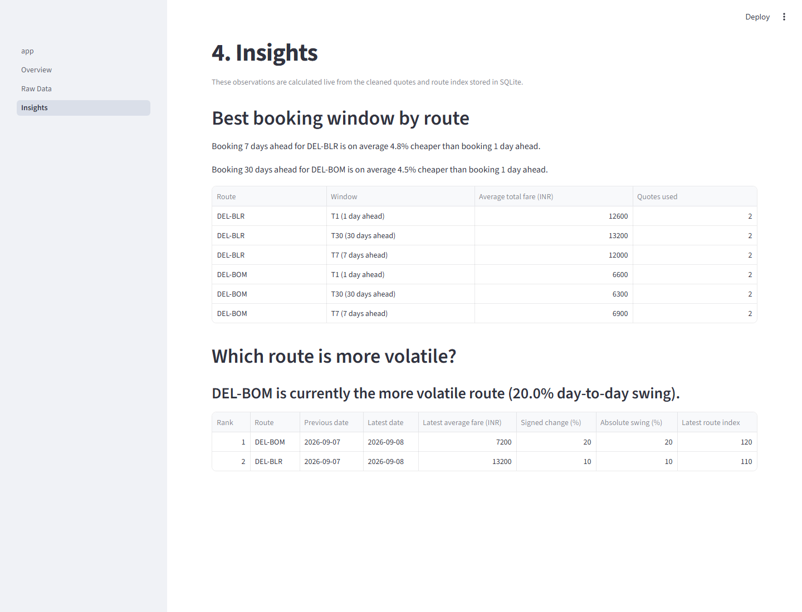
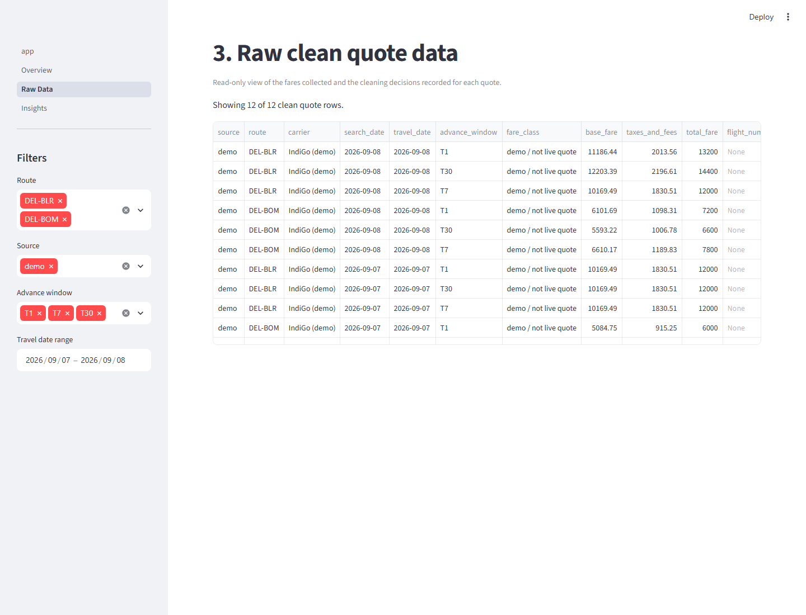

# APIx — Airfare Price Index

  <strong>A transparent, CPI-style price index for Indian domestic airfares.</strong> 
  APIx collects fare quotes, cleans and audits them, builds a daily index, and exposes the result through an API and interactive dashboard.

  
  
  
  
  

  

APIx is a working prototype for [Smart India Hackathon problem statement 26056](docs/PROJECT_BRIEF.md). It addresses a practical gap in airfare measurement: ticket prices move continuously with route, demand, source, and booking lead time, while traditional collection is periodic and manual. APIx turns those changing online quotes into a reproducible time series without hiding the raw observations or cleaning decisions.

## What the prototype covers

| Dimension | Implemented scope |
|---|---|
| Routes | Delhi → Mumbai (<code>DEL-BOM</code>) and Delhi → Bengaluru (<code>DEL-BLR</code>) |
| Sources | IndiGo and Ixigo |
| Booking windows | 1, 7, and 30 days before departure (<code>T1</code>, <code>T7</code>, <code>T30</code>) |
| Collection | Playwright scrapers with robots.txt checks, rate limiting, audit rows, and retry handling |
| Processing | Fare decomposition, deduplication, missing-value checks, sanity bounds, and IQR outlier flags |
| Index | Daily route indices and an overall fixed-basket index; weekly/monthly display aggregation |
| Delivery | FastAPI JSON API and a multi-page Streamlit dashboard |

## How it works

~~~mermaid
flowchart LR
    A[IndiGo scraper] --> C[(raw_quotes)]
    B[Ixigo scraper] --> C
    S[Daily scheduler] --> A
    S --> B
    C --> D[Cleaning pipeline]
    D --> E[(clean_quotes)]
    E --> F[Index engine]
    F --> G[(index_values)]
    E --> H[FastAPI]
    G --> H
    H --> I[Streamlit dashboard]

    classDef source fill:#e8f1ff,stroke:#3973ac,color:#152238;
    classDef store fill:#fff4d6,stroke:#d99b16,color:#3d2c05;
    classDef service fill:#e5f7ef,stroke:#15805d,color:#0d3b2e;
    class A,B,S source;
    class C,E,G store;
    class D,F,H,I service;
~~~

One scheduled cycle attempts all 12 source/route/window combinations. Every attempt is retained in <code>raw_quotes</code>, including <code>sold_out</code>, <code>no_results</code>, and terminal <code>error</code> results. Only successful observations enter the cleaning pipeline. Statistical outliers remain visible in <code>clean_quotes</code> with <code>is_outlier = 1</code>, but the index engine excludes them.

The first complete day is the base period. For each route and booking window, APIx calculates a price relative:

$$
r_{route,window,t} = \frac{\overline{fare}_{route,window,t}}{\overline{fare}_{route,window,base}}
$$

It averages the three booking-window relatives to create a route relative, then combines the two routes with a weighted geometric mean:

$$
APIx_t = 100 \times \prod_{route} R_{route,t}^{w_{route}}
$$

The prototype uses equal route weights (<code>0.5 / 0.5</code>) until verified DGCA passenger-share weights are supplied. See [INDEX_METHODOLOGY.md](docs/INDEX_METHODOLOGY.md) for the complete calculation and back-test method.

## Quick start

Requirements: Python 3.10 or newer. Python 3.13.5 is verified on this checkout.

~~~bash
git clone https://github.com/AdityaSinha0927/Flight-Price-Index.git
cd Flight-Price-Index/apix
python -m venv .venv
~~~

Activate the environment:

~~~powershell
# Windows PowerShell
.\.venv\Scripts\Activate.ps1
~~~

~~~bash
# macOS / Linux
source .venv/bin/activate
~~~

Install the application and the Playwright browser:

~~~bash
python -m pip install -r requirements.txt
python -m playwright install chromium
~~~

Seed the clearly labelled offline demo data, clean it, and build the index:

~~~bash
python -m db.seed_demo
python -m pipeline.clean
python -m index.build_index
~~~

Start the API and dashboard together:

~~~bash
python run_dashboard.py
~~~

Open <code>http://localhost:8501</code>. The launcher starts FastAPI on <code>http://127.0.0.1:8001</code>, waits for its health check, and then starts Streamlit. Closing Streamlit also stops the API process started by the launcher.

## Dashboard

The Streamlit interface is organized around three questions:

- **Overview:** What is the current index, how is it moving, and how do routes and booking windows compare?
- **Insights:** Which booking window has been cheapest, and which route is showing the largest day-to-day fare swing?
- **Raw Data:** Which observations and cleaning decisions produced the result?

<table>
  <tr>
    <td width="50%"></td>
    <td width="50%"></td>
  </tr>
  <tr>
    <td align="center"><strong>Derived booking and volatility insights</strong></td>
    <td align="center"><strong>Auditable cleaned quote records</strong></td>
  </tr>
</table>

The overview also supports daily, weekly, and monthly index views, route comparison, lead-time elasticity, recent cleaned quotes, cached last-known data, and a rebased comparison with the official MoSPI airfare CPI when <code>cpi_1059.xlsx</code> is available.

## Run the data pipeline

Run one complete collection and processing cycle:

~~~bash
python -m scraper.scheduler
~~~

Keep the scheduler running and execute every day at 06:00 local time:

~~~bash
python -m scraper.scheduler --loop --at 06:00
~~~

Useful one-off commands:

~~~bash
# Run a historical/date-specific collection attempt
python -m scraper.scheduler --date 2026-09-22

# Rebuild clean_quotes from raw_quotes
python -m pipeline.clean

# Rebuild index_values from clean_quotes
python -m index.build_index
~~~

Re-running the collector for the same source, route, booking window, and search date is safe: the database uniqueness constraint prevents duplicate audit rows.

### Scraping behavior

The scraper deliberately favors responsible failure over evasion. It:

- checks each source's <code>robots.txt</code> and fails closed when access cannot be confirmed;
- identifies itself as <code>APIx-Research-Bot/0.1</code>;
- waits a randomized 3–6 seconds between requests to the same domain;
- retries one failed page once after 30 seconds;
- records unsuccessful attempts instead of silently dropping them;
- does not use CAPTCHA solving, proxy rotation, stealth plugins, or browser impersonation.

Commercial flight sites frequently change markup or restrict automated result pages. At the time this prototype was validated, Ixigo disallowed its configured results path and IndiGo rejected the declared research-bot request to <code>robots.txt</code>. The repository therefore includes a labelled <code>demo</code> data source for deterministic evaluation. Use an authorized feed or commercial API before unattended production collection.

## API

Start the API independently:

~~~bash
python -m uvicorn api.main:app --host 127.0.0.1 --port 8001 --reload
~~~

Interactive OpenAPI documentation is available at <code>http://127.0.0.1:8001/docs</code>.

| Endpoint | Purpose | Key query parameters |
|---|---|---|
| <code>GET /api/v1/health</code> | Service status and latest scrape timestamp | — |
| <code>GET /api/v1/index</code> | Daily, weekly, or monthly index series | <code>route</code>, <code>freq</code>, <code>start_date</code>, <code>end_date</code> |
| <code>GET /api/v1/quotes</code> | Cleaned observations for audit and analysis | <code>route</code>, <code>advance_window</code>, date range |
| <code>GET /api/v1/elasticity</code> | Mean fare by booking window | <code>route</code> |

Example:

~~~bash
curl "http://127.0.0.1:8001/api/v1/index?route=ALL&freq=daily"
~~~

~~~json
{
  "route": "ALL",
  "freq": "daily",
  "base_period": "2026-09-07",
  "data": [
    {"date": "2026-09-07", "index_value": 100.0},
    {"date": "2026-09-08", "index_value": 114.89125293076054}
  ]
}
~~~

## Project structure

~~~text
apix/
├── scraper/          Playwright source adapters, shared controls, scheduler
├── pipeline/         Cleaning rules and raw → clean transformation
├── index/            Fixed-basket index calculation and aggregation
├── api/              FastAPI application and response models
├── dashboard/        Streamlit entry point and dashboard pages
├── db/               SQLite schema, database, and demo-data seeder
├── tests/            Cleaning, index, parser, API, and scheduler tests
├── docs/             Specifications, methodology, and project visuals
├── run_dashboard.py  Combined local API/dashboard launcher
└── requirements.txt
~~~

The design documents are intentionally kept alongside the code:

- [Architecture](docs/ARCHITECTURE.md)
- [Data schema](docs/DATA_SCHEMA.md)
- [Cleaning rules](docs/CLEANING_RULES.md)
- [Index methodology](docs/INDEX_METHODOLOGY.md)
- [API contract](docs/API_SPEC.md)
- [Scraper specification](docs/SCRAPER_SPEC.md)
- [Dashboard specification](docs/DASHBOARD_SPEC.md)

## Tests

~~~bash
pytest -q
~~~

Current result: **14 tests passing**. The suite covers fare decomposition, duplicate handling, sanity bounds, IQR outlier flags, parser safeguards, scheduler idempotency, API behavior, base-period normalization, price-relative calculations, and weekly/monthly aggregation.

## Current limitations

- The prototype is intentionally limited to two one-way routes, two sources, and three booking windows.
- Route weights are equal until verified passenger-share data is integrated.
- A total-only fare is decomposed using <code>base_fare = total_fare / 1.18</code>; the record is marked <code>tax split estimated</code>.
- Source URLs and DOM selectors require maintenance when booking sites change.
- The included scheduler is a foreground process. A deployment should supervise it with an operating-system scheduler or service manager.
- The MoSPI comparison requires <code>cpi_1059.xlsx</code> through <code>APIX_MOSPI_CPI_PATH</code> or in the project/workspace. It is a rebased trend comparison, not an exact level match.

## Team

Built as the **GIT PASS** prototype for Smart India Hackathon 2026. Code scaffolding and implementation assistance were provided by OpenAI Codex.
